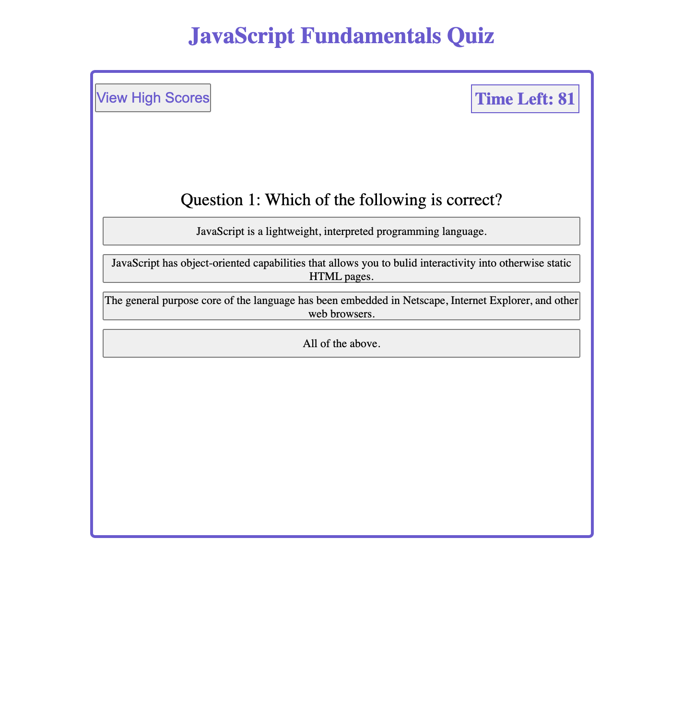

# JavaScript Fundamentals Quiz

## Purpose
Develop a web based quiz application. The quiz consist of 6 questions and test you on your basic knowledge of JavaScript.

## Built With
* HTML
* CSS 
* JavaScript

## Website
https://omcewan.github.io/javascript-the-fundamentals/

## Screenshots
The following are sample screenshots of the game:

